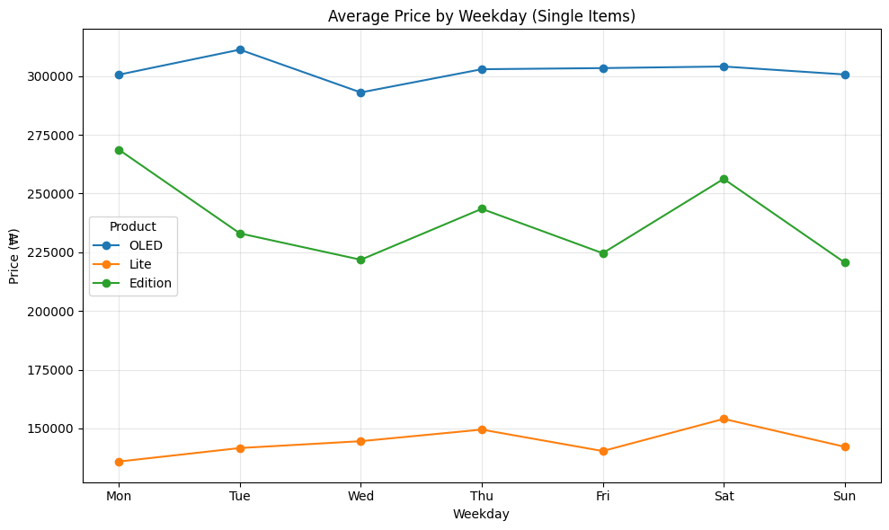

# 지역 및 요일에 따른 당근마켓 시장에서의 닌텐도 스위치 중고 시세 분석 보고서

> 프로젝트 명 : Carrot Region Analysis
> 
> 분석 기간 : 2025.04.18 - 2025.04.20
>
> 작성자 : 김민성
>
> 목적 : 중고 거래 플랫폼 "당근마켓" 안에서의 시세 패턴 파악

## 1. 📌 분석 배경 및 목적
* 닌텐도 스위치 제품은 중고 시장에서 꾸준한 거래량을 보이는 고가 전자기기다.
* 특히 제품 모델(OLED, Lite, Edition)에 따라 시세 차이가 클것으로 예상됨
* 본 분석은 거래 지역, 요일, 제품 종류/구성을 기준으로 중고 시세의 구조를 파악하는것이 목적

## 2. 🧾 데이터 개요
|항목 | 내용|
|-------|----|
|출처 | 당근마켓 (크롤링 수집)|
|기간 | 강남, 분당, 부산의 각 동별 최대 백개의 게시글|
|대상 | “닌텐도 스위치” 키워드 포함 게시글||
컬럼 | `title`, `content`, `gu`, `dong`, `price`, `posted_time`, `status`, `is_OLED`, `is_Lite`, `is_Edition`, `is_Set` 등 총 12개|

* 전처리
  * 제품 분류 플래그 생성 : `is_OLED`, `is_Lite`, `is_Edition`
  * 세트 구성 분류 플래그 생성 : `is_Set` (키워드 기반 분석)

## 3. 🔍 분석 항목 요약

|분석 항목|	요약 내용|	주요 인사이트|
|-------|--------|------------|
|지역별 평균 가격|	단품 평균가 비교|	부산 > 강남 > 분당 순으로 고가 분포|
|제품별 세트/단품 차이|	OLED/Lite/Edition 평균 비교|	Edition이 세트일 때 평균 +23,000원 상승|
|요일별 단품 가격|	제품별 요일 평균가 비교|	Edition은 요일별 변동폭 큼, OLED는 안정적|
|단품 매물 수	|지역별 거래량 비교	|강남/서초에 매물 집중, Lite는 희소|

## 4. 📈 주요 결과 요약 

### 4-1. 제품별 세트 / 단품 가격 차이
| 제품명   | 단품 평균 | 세트 평균 | 평균 가격 차이 |
|----------|-----------|-----------|------------|
| OLED     | 302,609원 | 314,793원 | + 12,184원   |
| Lite     | 144,440원 | 166,774원 | + 22,334원   |
| Edition  | 238,652원 | 261,664원 | + 23,013원   |

### 4-2. 요일별 단품 가격 차이
|weekday  |OLED 평균가  |Lite 평균가  |Edition 평균가|
|----------|----------|------------|------------|
|Mon   |300,633       |135,875     |268,684|
|Tue   |311,294       |141,633     |233,048|
|Wed   |293,068       |144,545     |221,818|
|Thu   |302,955       |149,484     |243,500|
|Fri   |303,438       |140,345     |224,600|
|Sat   |304,115       |154,038     |256,250|
|Sun   |300,721       |142,167     |220,652|

### 4-3. 지역별 단품 가격 차이와 개수 차이
|gu   |평균 가격  |매물 수|
|-----|---------|------|
|부산진구 |236,654   |355|
|강남구   |229,816   |353|
|분당구   |227,531   |312|

## 5. 📎 결론 및 향후 과제
* 결론 : 제품 모델/구성/지역/요일별로 명확한 시세 차이가 존재한다.
* 향후 과제
  * 제품의 상태, 세트에 포함 되는 항목(ex 악세서리, 게임 칩, etc)등에 따른 텍스트 기반 영향을 분석을 하면 더 정확할 듯 하다.
  * 지도 api를 불러와 팝업형식으로 보여주면 평균가격을 조금 더 시각적으로 보여줄 수 있을듯 하다.
